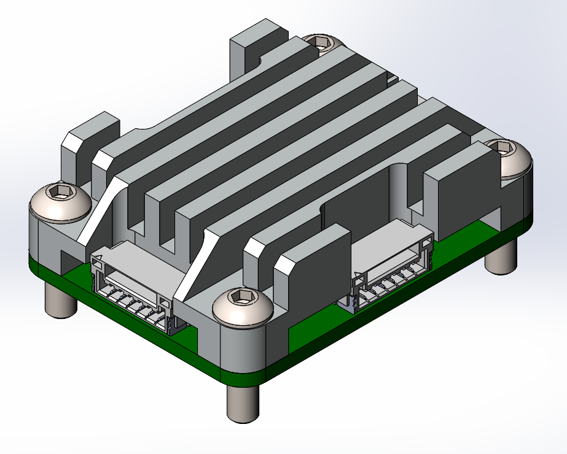
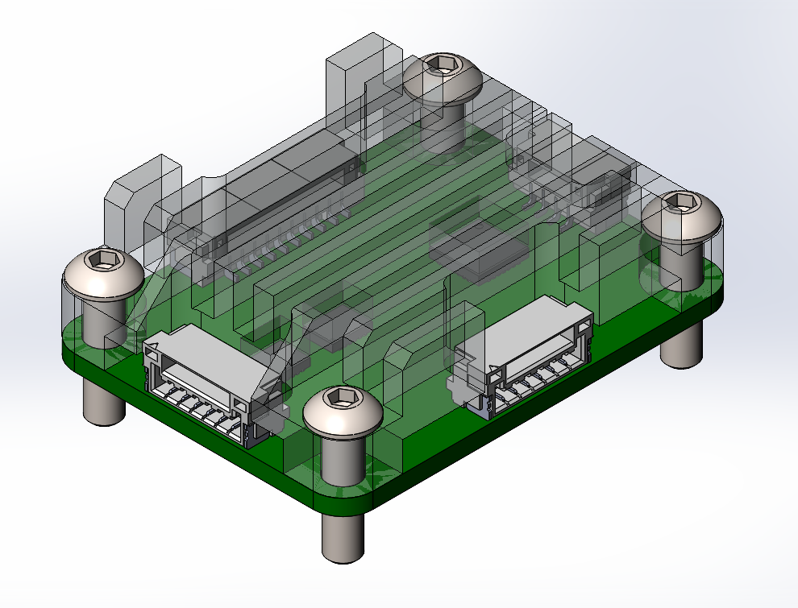
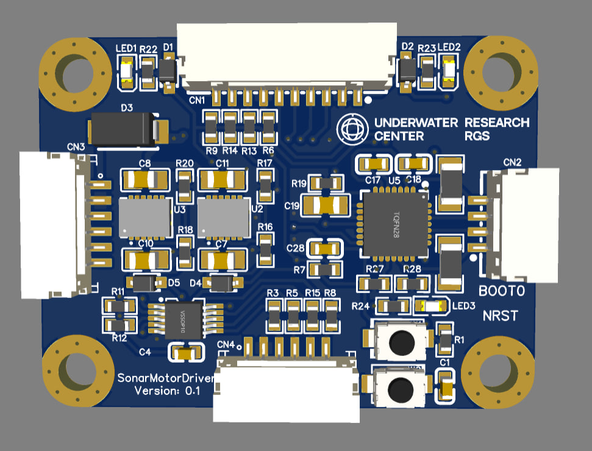
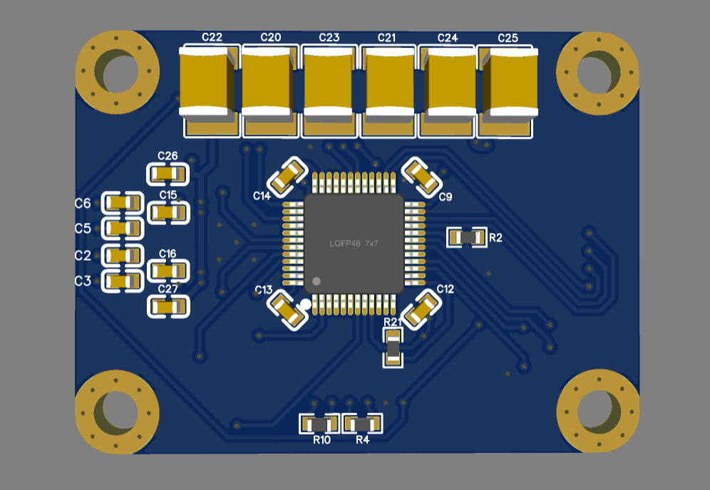

# SonarMotorDriver

Проект драйвера шагового двигателя с замкнутым контуром управления (PID) по абсолютному энкодеру LENZ IRS (BiSS C). В репозитории — прошивка для **STM32F103C8**, 3D-сборка платы, даташиты и иллюстрации.

> **Примечание:** Управление TMC2209 по UART (ток, микрошаг, вращение) проверено на аппаратуре целевой платы — мотор вращается, энкодер отвечает, драйвер подтверждает конфигурацию (`mcfg`). Пин **DIAG** (StallGuard/Open Load) разведён, но программно не опрашивается.

## Иллюстрации

| CAD: сборка с радиатором | CAD: сборка с прозрачным кожухом |
| --- | --- |
|  |  |

| Плата: верхний слой (релиз 0.1) | Плата: нижний слой (релиз 0.1) |
| --- | --- |
|  |  |

## Структура репозитория

| Каталог | Описание |
|---------|----------|
| [**Software/FW_SonarMotorDriver/**](Software/FW_SonarMotorDriver/) | Основная прошивка STM32F103C8: PID, энкодер BiSS C, TMC2209, **UART** (команды и телеметрия), IWDG |
| [**Software/FW_SonarMotorDriver_Sim/**](Software/FW_SonarMotorDriver_Sim/) | Имитатор основной прошивки: тот же UART-протокол (команды и телеметрия), но без реального энкодера и TMC2209 — для отладки ПО верхнего уровня без подключённого мотора |
| [**Software/Test_TMC2209/**](Software/Test_TMC2209/) | Отладочная прошивка **STM32F103C8** + TMC2209: **UART CLI** через внешний USB-UART переходник, проверка драйвера отдельно от основной платы |
| [**Hardware/CAD/**](Hardware/CAD/) | 3D-модели (SolidWorks/STEP): сборка с радиатором и кожухом, радиатор, STEP компонентов BOM |
| [**Docs/Datasheet/**](Docs/Datasheet/) | PDF-даташиты ключевых компонентов (STM32, TMC2209, THVD1452, питание, разъёмы и т.д.) |
| [**Image/**](Image/) | Рендеры платы и CAD для документации |

## Возможности (основная прошивка)

- **PID** — замкнутый контур по энкодеру, привязка к микрошагу, переход в open-loop при потере связи с энкодером
- **LENZ IRS** — абсолютная позиция 17–18 бит по BiSS C (SPI + DMA + THVD1452)
- **TMC2209** — STEP/DIR/ENABLE, UART для тока и микрошага
- **UART (USART1)** — текстовые команды и телеметрия (период настраивается, режимы `debug=0` / `debug=1`)
- **IWDG** — сторожевой таймер

Подробности, распиновка, протокол команд и BiSS C — в [Software/FW_SonarMotorDriver/README.md](Software/FW_SonarMotorDriver/README.md).

## Быстрый старт (сборка основной прошивки)

```bash
cd Software/FW_SonarMotorDriver
pio run                    # сборка
pio run --target upload    # прошивка (см. platformio.ini: ST-Link / WCH-Link + OpenOCD)
```

Имитатор UART-протокола (без мотора и энкодера): [Software/FW_SonarMotorDriver_Sim/README.md](Software/FW_SonarMotorDriver_Sim/README.md).
Тестовая прошивка драйвера TMC2209: [Software/Test_TMC2209/README.md](Software/Test_TMC2209/README.md).

## Требования

- **PlatformIO** — сборка прошивок в `Software/`
- **Программатор** — ST-Link, CMSIS-DAP или иной, совместимый с настройками `upload` в `platformio.ini`
