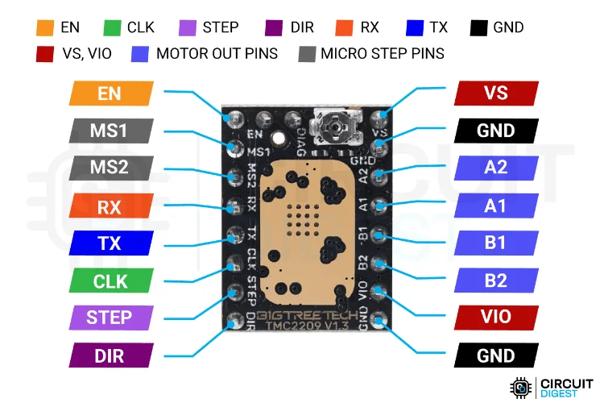

# FW_SonarMotorDriver — Closed-Loop Stepper

Прошивка для STM32F103C8 (Blue Pill): позиционное управление шаговым двигателем
через **TMC2209** с обратной связью от абсолютного энкодера **LENZ IRS** (BiSS C).
При потере энкодера — автоматический переход в **open-loop**. Настройка и мониторинг — через **UART** (PA9/PA10).

> **Примечание:** Управление TMC2209 по UART (ток, микрошаг, вращение STEP/DIR) проверено на аппаратуре — мотор вращается, энкодер отвечает (`ec:0`), `mcfg` подтверждает конфигурацию драйвера. Пин **DIAG** (StallGuard/Open Load) разведён, но программно не опрашивается.
>
> **См. также:** [FW_SonarMotorDriver_Sim](../FW_SonarMotorDriver_Sim/README.md) — имитатор этого же UART-протокола без реального энкодера и TMC2209, для отладки ПО верхнего уровня. Сводное описание протокола (все команды, телеметрия, тайминги, USART3-дублирование) — в [Docs/Protocol.md](../../Docs/Protocol.md); разделы «Команды (UART)» и «Телеметрия» ниже описывают то же самое в контексте этой прошивки.

## Содержание

- [Архитектура](#архитектура)
- [Аппаратная часть](#аппаратная-часть)
- [Структура проекта](#структура-проекта)
- [Сборка и прошивка](#сборка-и-прошивка)
- [Использование](#использование)
- [Конфигурация](#конфигурация)
- [API модулей](#api-модулей)
- [Протокол BiSS C](#протокол-biss-c)
- [Устранение неисправностей](#устранение-неисправностей)
- [Открытый вопрос: вывод DIAG](#открытый-вопрос-вывод-diag)

---

## Архитектура

```
                    Замкнутый контур управления (1 кГц)

 Уставка       ошибка   ┌─────────┐   шаги    ┌──────────────────────┐
 (t=X) ──────►(Σ)──────►│   PID   ├──────────►│ MotorDriver          ├──────► Мотор
               ▲ −      │ Kp+Ki+Kd│           │ (STEP_DIR или UART)  │    │
               │        └─────────┘           └──────────────────────┘    │
               │                                                          │
               │        ┌──────────────────┐                              │
               └────────┤  Encoder + BiSS  │◄─────────────────────────────┘
            pos_deg     │  SPI+DMA+THVD1452│   обратная связь
                        └──────────────────┘

 CL: PID(target − pos) → шаги (основной)
 OL: clamp(target − ol_pos) → шаги (при потере энкодера ≥ 500 мс)

 ┌──────┐   UART    ┌──────────┐
 │  ПК  │◄─────────►│   Cmd    ├──► en / dis / t= / t=± / kp= / ki= / kd= / op= / om= / scan= / sync= / hold= / stop
 │      │  USART1   │  Parser  │     запросы состояния (ответ без ok:): mcfg / sync / om / hold
 └──────┘ PA9/PA10  └──────────┘
 ПК ◄── Телеметрия (UART TX): debug=0 → cp,ec
                              debug=1 → cp,tp,pe,u,m,ec,kp,ki,kd,v,a,of,drp
                              om=1/2  → тот же кадр + ,ev:1 по приходу в цель
```

### Режимы управления


| Режим                | Условие                     | Поведение                                                   |
| -------------------- | --------------------------- | ----------------------------------------------------------- |
| **cl** (closed-loop) | Энкодер отвечает            | PID по ошибке `target − position`, вывод ограничен deadband |
| **ol** (open-loop)   | Энкодер не отвечает ≥500 мс | Прямое позиционирование: `clamp(target − ol_pos)` без PID   |


Переключение автоматическое:

- **cl → ol:** после `ENCODER_FAIL_MS` (500 мс) без ответа энкодера.
- **ol → cl:** при первом успешном ответе, интеграл PID сбрасывается.

### Стартовая диагностика энкодера

До включения мотора прошивка выполняет серию из `ENCODER_DIAG_SAMPLES` (16) чтений BiSS C
с интервалом `ENCODER_DIAG_INTERVAL_MS` (2 мс) и разрешает автоматический выход в «дом» только если:

- валидных ответов (OK/WARNING) не меньше `ENCODER_DIAG_MIN_OK` (12 из 16);
- разброс позиции при неподвижном вале не превышает `ENCODER_DIAG_MAX_SPREAD_DEG` (0.5°).

Результат отправляется хосту одной строкой:

```
enc:ok n=16/16 spread=0.004 pos=37.52     ← диагностика пройдена, далее хоуминг
err:enc n=3/16 spread=0.000 last=2        ← провал: мотор остаётся выключенным
```

При провале позиция продолжает отслеживаться, но движение возможно только по явной
команде оператора (`en`, `t=…`). Ту же проверку можно запустить в любой момент командой `diag`
(на остановленном моторе): ответ `ok:diag`, затем через ~16 мс строка `enc:ok` / `err:enc`.

### Фильтр выбросов показаний энкодера

CRC6 кадра BiSS слабая (искажённый кадр проходит проверку с вероятностью ~1/64), поэтому
поверх CRC работает фильтр правдоподобия: показание отбрасывается, если сдвиг от последней
принятой позиции превышает физически возможный — `ENCODER_OUTLIER_MAX_DELTA_DEG` (3°) за тик
1 мс (потолок скорости 1200°/с = 1.2°/мс, порог с запасом 2.5×). Бюджет сдвига масштабируется
на длительность пропуска данных (до 60° — дальше дельта неоднозначна из-за перехода через ноль).

- Отброшенное показание не попадает в контур управления (тик считается «без данных»),
  в телеметрии на этот момент `ec:6`, накопительный счётчик — поле `of` (debug=1).
- Реальный скачок позиции (проскальзывание муфты, восстановление энкодера после долгой
  потери связи на ходу) отличается от выброса устойчивостью: `ENCODER_OUTLIER_STREAK` (3)
  согласных чтений подряд — и новая позиция принимается (перепривязка за ~3 мс).

> **Известное ограничение (single-turn энкодер).** Перепривязка по streak принимает
> скачок любой величины, а дельта позиции сворачивается в диапазон ±180° (через ноль
> счётчика). Если энкодер восстанавливается на ходу после поворота более чем на ½ оборота
> между последним валидным чтением и перепривязкой, многооборотный счётчик `g_enc_counts`
> может ошибиться на целый оборот (±360°). Это следствие однооборотности датчика: истинное
> число совершённых оборотов при разрыве связи неизвестно. На штатных скоростях и при
> непрерывном опросе (1 кГц) ситуация не возникает.

### Контур (1 кГц)

1. **TIM2** — флаг UIF каждые 1 мс.
2. **BiSS C** — чтение позиции через SPI1 + DMA + THVD1452 (неблокирующее).
3. **Encoder_Accumulate** — многооборотная позиция с обработкой перехлёста.
4. **Mode_Update** — счётчик сбоев: ≥500 мс без ответа → ol; при ответе → cl.
5. **MotorControl_Tick** — CL: PID → шаги; OL: прямое позиционирование.
6. **Stall_Tick** — защита от блокировки вала (см. ниже).
7. **Scan_Tick** — сканирование сектора (zigzag start↔end или бесконечное в одном направлении, до команды stop); пин синхронизатора PB9 (SYNC_OUT); переход к следующей точке по таймеру delay и/или фронту SYNC_IN (PB12) — режим `sync=0/1/2`.
8. **Telemetry_Tick** — вывод по таймеру (250 Гц по умолчанию) и/или по достижению цели (`om=`, кадр с `ev:1`): debug=0 → cp,ec; debug=1 → полная.
9. **Heartbeat_Tick** — мигание LED ~1 Гц.

### Профиль движения: скорость и ускорение (v= / a=)

Пределы движения настраиваются на лету, без перепрошивки:

- **`v=<°/с>`** — рабочий предел скорости (1..1200). Действует на все виды движения:
  позиционирование, сканирование, непрерывное вращение. По умолчанию 1200 °/с.
- **`a=<°/с²>`** — предел ускорения (0..100000). По умолчанию **2000 °/с²**
  (разгон до потолка скорости ≈ за 0.6 с). Специальное значение **`a=0`
  отключает рампу** — скорость меняется мгновенно. При `a > 0`:
  - скорость нарастает/спадает не быстрее `a` (трапецеидальная рампа);
  - при подъезде к цели действует тормозной конверт `v ≤ sqrt(2·a·|ошибка|)` —
    мотор успевает остановиться без перелёта.

Текущие значения видны в полной телеметрии (`debug=1`, поля `v` и `a`).
Ограничение применяется поверх PID: выход регулятора обрезается по скорости
и ускорению перед квантованием в микрошаги.

### Защита от блокировки вала (stall)

В closed-loop прошивка сравнивает скомандованный путь с фактическим смещением вала
по энкодеру. Если за `STALL_TIMEOUT_MS` (1 с) мотору скомандовано не меньше
`STALL_MIN_CMD_DEG` (1°), а вал сместился меньше чем на `STALL_MEAS_FRACTION` (25%)
этого пути — вал считается заблокированным:

- драйвер выключается (ENN = HIGH, как по команде `dis`), сканирование и вращение сбрасываются;
- хост получает строку `err:stall cmd=<скомандовано°> meas=<фактически°> pos=<позиция°>`;
- возврат в работу — командой `en` (цель привязывается к текущей позиции, рывка не будет).

Защита действует при любом движении в CL: позиционирование `t=`, хоуминг, сканирование
`scan=`, непрерывное вращение `t=+`/`t=-`. В open-loop (энкодер недоступен) фактическое
положение вала неизвестно и защита не работает. Пороги — в `board.h` (`STALL_*`).

### Устойчивость приёма команд (UART RX)

RX работает через DMA в циклическом режиме. При ошибке линии (шум при подключении/отключении разъёма, framing error, overrun) HAL останавливает DMA-приём — без восстановления команды перестали бы приниматься до перезагрузки. `HAL_UART_ErrorCallback()` в `uart.c` сбрасывает флаги ошибок и перезапускает `HAL_UART_Receive_DMA()`, так что приём восстанавливается автоматически в течение одного тика. Передача телеметрии (TX) этой ошибкой не затрагивается и продолжается всегда.

### Приоритеты прерываний


| Приоритет | Источник         | Назначение                                    |
| --------- | ---------------- | --------------------------------------------- |
| 5         | TIM4             | STEP-импульсы (счёт доводочных серий)         |
| 6         | TIM2             | Сэмплирование энкодера (1 кГц)                 |
| 7         | DMA1_Ch2/Ch3     | SPI1 RX/TX для BiSS C                          |
| 8         | USART1 / USART3  | IDLE line detection (команды, дублирование TX) |
| 8         | DMA1_Ch4/Ch5     | UART1 TX/RX DMA (команды, телеметрия)          |
| 15        | SysTick          | HAL_GetTick() (для таймаутов HAL)             |

> **Блокирующие HAL-вызовы с таймаутами разрешены только в контексте main**
> (SysTick заморожен на приоритетах < 15): на уровне TIM2/TIM4/DMA `HAL_GetTick()`
> не тикает, поэтому таймаут HAL там никогда не истечёт (см. `BiSS_Abort` —
> регистровый аборт без wait-циклов).


---

## Аппаратная часть

> [!IMPORTANT]
> **Питание драйвера (VS):** Драйвер TMC2209 необходимо всегда подключать с дополнительным электролитическим конденсатором (рекомендуется 100–470 мкФ) по линии питания **VS** (как можно ближе к пинам VS и GND) для сглаживания бросков напряжения и защиты чипа.

### Выводы STM32


| Вывод | Функция       | Назначение                                          |
| ----- | ------------- | --------------------------------------------------- |
| PA5   | SPI1_SCK      | MA → THVD1452 D                                     |
| PA6   | SPI1_MISO     | SLO ← THVD1452 R                                    |
| PA9   | USART1_TX     | UART TX (команды, телеметрия) → ПК                  |
| PA10  | USART1_RX     | UART RX (команды) ← ПК                              |
| PB0   | GPIO_OUT (DE) | Driver Enable THVD1452 (active HIGH)                |
| PB1   | GPIO_OUT (RE) | Receiver Enable THVD1452 (active LOW)               |
| PA2   | USART2_TX     | UART TMC2209 → PDN_UART (через 1 кОм)               |
| PA3   | USART2_RX     | UART TMC2209 ← PDN_UART (общая линия)               |
| PB6   | GPIO_OUT      | ENN TMC2209 (LOW = вкл)                             |
| PB7   | GPIO_OUT      | DIR TMC2209                                         |
| PB8   | TIM4_CH3 AF   | STEP TMC2209 (PWM)                                  |
| PA7   | не настроен   | DIAG TMC2209 (StallGuard, Open Load; HIGH = ошибка) — вывод разведён на плате, но прошивка его не конфигурирует и не читает: макросов `DIAG_PORT`/`DIAG_PIN` в `board.h` нет (см. «[Открытый вопрос: вывод DIAG](#открытый-вопрос-вывод-diag)») |
| PB9   | GPIO_OUT      | SYNC_OUT (HIGH=позиция достигнута, LOW=движение)    |
| PB12  | GPIO_IN       | SYNC_IN (внешний триггер: скан по фронту, `sync=1/2`) |
| PC13  | GPIO_OUT      | LED heartbeat (~1 Гц)                               |


### Схема подключения

```
  STM32F103          THVD1452                  Энкодер LENZ IRS
 ┌──────────┐      ┌──────────┐      ┌──────────────────────────┐
 │      PA5 ├─────►│ D      Y ├─────►│ MA+  (pin 3, жёлтый)     │
 │ (SPI_SCK)│      │        Z ├─────►│ MA−  (pin 4, зелёный)    │
 │      PA6 │◄─────┤ R      A │◄─────┤ SLO+ (pin 5, синий)      │
 │(SPI_MISO)│      │        B │◄─────┤ SLO− (pin 6, белый)      │
 │      PB0 ├─────►│ DE       │      │                          │
 │      PB1 ├─────►│ RE       │      │                          │
 └──┬───┬───┘      └──────────┘      └──────────────────────────┘
    │   │
    │   │            TMC2209                      Шаговый двигатель
    │   │         ┌──────────────┐      ┌──────────────────────────┐
    │   ├── PB8 ─►│ STEP      A1 ├─────►│ зелёный  (обмотка A)     │
    │   ├── PB7 ─►│ DIR       A2 ├─────►│ чёрный   (обмотка A)     │
    │   ├── PB6 ─►│ ENN       B1 ├─────►│ синий    (обмотка B)     │
    │   ├── PA2 ─►│ PDN_UART  B2 ├─────►│ красный  (обмотка B)     │
    │   ├── PA3 ◄─┤ PDN_UART     │      │                          │
    │   └── PA7 ◄─┤ DIAG         │      │                          │
    │             └──────────────┘      └──────────────────────────┘
    ├── PB9  ──►  SYNC_OUT (позиция достигнута)
    ├── PA9  ──►  UART TX ──► ПК (115200 8N1)
    ├── PA10 ◄──  UART RX ◄── ПК
    ├── PB12 ◄──  SYNC_IN (внешний триггер)
    └── PA9/PA10 ── UART → ПК (COM-порт, команды и телеметрия)
```

### Распиновка TMC2209



| Контакт    | Описание                                                                                   |
| ---------- | ------------------------------------------------------------------------------------------ |
| **EN**     | Enable — разрешение работы драйвера. LOW = включён, HIGH = отключён (обмотки обесточены)   |
| **MS1**    | Microstep select 1 — вместе с MS2 задаёт режим микрошага (таблица в датащите)             |
| **MS2**    | Microstep select 2 — вместе с MS1 задаёт режим микрошага                                  |
| **RX**     | UART RX (PDN_UART) — приём данных от MCU для конфигурации по UART                         |
| **TX**     | UART TX (PDN_UART) — передача данных в MCU (общая линия с RX через резистор)              |
| **CLK**    | Clock — внешний тактовый сигнал (оставить незаземлённым для использования внутреннего RC) |
| **STEP**   | Step — вход импульсов шага от MCU. Каждый импульс HIGH→LOW = один микрошаг               |
| **DIR**    | Direction — направление вращения. HIGH = вперёд, LOW = назад                              |
| **VS**     | Motor supply voltage — питание силовой части (обмоток), 4.75–29 В. **Обязателен внешний конденсатор!** |
| **GND**    | Ground — общий минус                                                                       |
| **A1**     | Обмотка A, вывод 1 — первый провод первой обмотки шагового двигателя                      |
| **A2**     | Обмотка A, вывод 2 — второй провод первой обмотки шагового двигателя                     |
| **B1**     | Обмотка B, вывод 1 — первый провод второй обмотки шагового двигателя                     |
| **B2**     | Обмотка B, вывод 2 — второй провод второй обмотки шагового двигателя                     |
| **VIO**    | Logic supply voltage — питание логической части (3.3–5 В)                                 |

### Выводы энкодера


| Пин | Функция | Цвет провода |
| --- | ------- | ------------ |
| 1   | Vcc     | Красный      |
| 2   | GND     | Чёрный       |
| 3   | MA+     | Жёлтый       |
| 4   | MA−     | Зелёный      |
| 5   | SLO+    | Синий        |
| 6   | SLO−    | Белый        |


Разъём: Amphenol FCI 10114830-11106LF.

### Подключение шагового двигателя (4 провода)

Двигатель с проводами **синий**, **зелёный**, **красный** и **чёрный** подключается к выходам TMC2209 (обмотки A и B) следующим образом:


| Подключение TMC2209 | Цвет провода |
| ------------------- | ------------ |
| A1                  | Зелёный      |
| A2                  | Чёрный       |
| B1                  | Синий        |
| B2                  | Красный      |


Зелёный и чёрный — одна обмотка (A), синий и красный — вторая обмотка (B). Если направление вращения противоположное ожидаемому, поменяйте местами провода одной обмотки (например, A1↔A2 или B1↔B2).


### Тактирование

Источник: HSI


| Домен      | Частота            |
| ---------- | ------------------ |
| SYSCLK     | 48 МГц             |
| APB1       | 24 МГц             |
| APB2       | 48 МГц             |
| SPI1 (MA)  | 0.75 МГц (APB2/64) |
| TIM2       | 48 МГц (APB1 × 2)  |
| DWT CYCCNT | 48 МГц (SYSCLK)    |
| TIM4       | 48 МГц (APB1 × 2)  |


Проект использует **единый моторный фасад** внутри библиотеки `lib/tmc2209`, который объединяет:

- **Core Driver** — низкоуровневая библиотека для TMC2209 (регистры, UART, конфиг).
- **Platform Port** — STM32 HAL-специфичная реализация (GPIO, TIM, UART к TMC2209 на `USART2`).
- **Motor Backend** — логика генерации импульсов (STEP/DIR через TIM4 или UART VACTUAL).
- **Diagnostics** — периодический опрос `DRV_STATUS` каждые 500 мс **только на остановленном моторе**: обмен по UART блокирующий (~4–5 мс), на ходу он прерывал бы поток STEP-импульсов (периодический рывок), поэтому во время движения/сканирования пропускается.

Приложение работает только с высокоуровневым API: `tmc2209_motor_init()`, `tmc2209_motor_set_enabled()`, `tmc2209_motor_move_steps()`, `tmc2209_motor_stop()` и т.д. Команды конфигурации во время выполнения (`irun`, `ihold`, `mstep`) возвращают дифференцированные коды ошибок:

- `ok` — успешно применено.
- `err:not ready` — драйвер не инициализирован.
- `err:bad arg` — недопустимый аргумент (например, неверный ток или шаг).
- `err:apply failed` — ошибка связи или применения настройки в чип.

### Режимы управления двигателем (board.h: MOTOR_DRIVER_MODE)


| Режим    | Значение | Описание                                                                 |
| -------- | -------- | ------------------------------------------------------------------------ |
| STEP_DIR | 0        | STEP/DIR импульсы от MCU (TIM4). Основной режим, позиционное управление. |
| UART     | 1        | VACTUAL / internal pulse generator TMC2209. Движение через UART API.     |


Режим задаётся compile-time в `board.h`:

```c
#define MOTOR_DRIVER_MODE  MOTOR_DRIVER_MODE_STEP_DIR_VAL  /* или MOTOR_DRIVER_MODE_UART_VAL */
```

### Инициализация

Один шаг `tmc2209_motor_init()` заменяет старые подходы. Внутри:

1. Инициализация UART к TMC2209 (USART2, blocking)
2. Инициализация lib/tmc2209 (конфиг, проверка связи)
3. STEP/DIR backend (если режим STEP_DIR): GPIO STEP/DIR, TIM4 PWM с preload
4. Подготовка subsystem без скрытого изменения enable state; политика включения выполняется приложением отдельным вызовом `tmc2209_motor_set_enabled()`

### Удалённые элементы

- Отдельный `stepper.c` — функциональность перенесена внутрь фасада
- Устаревшие `TMC2209_InitStart()` / `TMC2209_Poll()` — заменены на единый `tmc2209_motor_init()`
- Двойное управление ENN — теперь только через `tmc2209_motor_set_enabled()`

---

## Структура проекта

```
FW_SonarMotorDriver/
├── platformio.ini
├── include/
│   ├── board.h              — выводы, MOTOR_DRIVER_MODE, TMC2209_MICROSTEPS, PID
│   ├── stm32f1xx_hal_conf.h — конфигурация HAL
│   ├── biss_c.h             — BiSS C интерфейс
│   └── pid.h                — PID-регулятор
├── src/
│   ├── main.c               — init, главный цикл, контроллер, телеметрия
│   ├── biss_c.c             — BiSS C: SPI + DMA, CRC6, разбор кадра
│   └── pid.c                — PID с anti-windup
└── tools/
    ├── read_serial.py       — утилита чтения COM-порта
    └── test_commands.py     — автотест всех команд с логом (привязка по времени)
```

Драйвер TMC2209 вынесен из `lib/` прошивки в общую библиотеку
[`../lib/tmc2209`](../lib/tmc2209/README.md) — одна копия на эту прошивку и на
тестовый стенд `FW_Test_TMC2209`, который раньше жил на разошедшейся копии:

```
Software/lib/tmc2209/
├── library.json
├── include/tmc2209/         — публичный API, карта регистров, типы
│   ├── tmc2209.h            — ядро драйвера (протокол PDN_UART, регистры, диагностика)
│   ├── tmc2209_regs.h       — карта регистров и битовых полей
│   ├── tmc2209_types.h      — конфигурация и декодированные структуры
│   ├── tmc2209_port.h       — контракт порта (колбэки UART/GPIO/TIM)
│   ├── tmc2209_port_stm32_hal.h — контекст и MSP-хелперы порта STM32 HAL
│   └── tmc2209_motor.h      — фасад tmc2209_motor_* (его зовёт main.c)
└── src/
    ├── tmc2209.c
    ├── tmc2209_port_stm32_hal.c
    └── tmc2209_motor.c
```

Командный протокол (транспорт UART, сборка строк, парсер команд) вынесен из
`src/`+`include/` в общую библиотеку [`../lib/sonar_proto`](../lib/sonar_proto/README.md) —
одна копия на эту прошивку и на имитатор:

```
Software/lib/sonar_proto/
├── library.json
├── include/                 — заголовки в корне: #include "cmd_parser.h" работает как раньше
│   ├── uart.h               — командный UART (USART1 + USART3) API
│   ├── line_reader.h        — выделение строки из кольцевого буфера
│   └── cmd_parser.h         — парсер команд en/dis/t/t±/kp/ki/kd/op/om/debug/scan/sync/hold/stop и запросов mcfg/sync/om/hold
└── src/
    ├── uart.c
    ├── line_reader.c
    └── cmd_parser.c
```

Обе подключаются в `platformio.ini` явными ссылками на каталоги —
`lib_deps = symlink://../lib/sonar_proto` и `symlink://../lib/tmc2209`
(по короткому имени PlatformIO, не найдя каталога, молча тянет одноимённый
пакет из публичного реестра). Исходники библиотек берут `board.h` из `include/` этой
прошивки — оттуда приходят выводы, скорости и размеры буферов (`UART_*`,
`UART3_*`, `TMC2209_*`, `MOTOR_DRIVER_MODE`, `STEP_*`/`DIR_*`).


| Модуль        | Содержание                                                                                               |
| ------------- | -------------------------------------------------------------------------------------------------------- |
| `board.h`     | Константы: выводы, MOTOR_DRIVER_MODE, TMC2209_MICROSTEPS (256), PID, буферы                              |
| `main.c`      | BSP, clock, TIM2, DWT, init, CL/OL контроллер, команды, телеметрия. Вызывает tmc2209_motor_*             |
| `lib/tmc2209` (в `Software/lib/`) | Общая с тестовым стендом библиотека: регистры, UART к TMC2209 на `USART2`, порт STM32, генерация STEP/DIR (TIM4), диагностика |
| `lib/sonar_proto` (в `Software/lib/`) | Общий с имитатором слой протокола: `uart.c` + `line_reader.c` + `cmd_parser.c` |
| `uart.c`      | Драйвер command UART: на `USART1` — RX через DMA Circular + IDLE line и TX через DMA, на `USART3` — то же самое на прерываниях (DMA1 Ch2/Ch3 отданы SPI1 энкодера). Кольцевые буферы. При ошибке линии (шум/framing/overrun) автоматически перезапускает RX DMA (`HAL_UART_ErrorCallback`), чтобы приём команд не зависал навсегда. |
| `biss_c`      | BiSS C: SPI + DMA, разбор кадра, CRC6                                                                    |
| `pid`         | PID с anti-windup и ограничением выхода                                                                  |
| `cmd_parser`  | Парсер команд (en, dis, t=, t=±, kp=, ki=, kd=, op=, om=, debug=, scan=, sync=, hold=, stop) и запросов состояния (mcfg, sync, om, hold) |
| `uart`        | UART: `USART1` (PA9/PA10, **DMA circular RX + IDLE**, **DMA TX**) и `USART3` (PB10/PB11, прерывания — DMA1 Ch2/Ch3 заняты SPI1 энкодера). TX дублируется на оба порта, RX объединяется. Обслуживает только командный интерфейс и телеметрию ПК. |


---

## Сборка и прошивка

**Требования:** [PlatformIO CLI](https://docs.platformio.org/en/latest/core/installation.html) (или расширение для VS Code / Cursor), программатор ST-Link или совместимый (в `platformio.ini` по умолчанию задан WCH-Link через OpenOCD).

```bash
pio run                   # Сборка
pio run --target upload   # Прошивка
```

Код проекта собирается со строгими предупреждениями `-Wall -Wextra`
(`build_src_flags` в [platformio.ini](platformio.ini) — именно `build_src_flags`,
чтобы флаги не попали на исходники STM32Cube HAL). Общие библиотеки из
`Software/lib` включают те же флаги у себя в `library.json`. Сборка должна
проходить без единого предупреждения в нашем коде.

**IDE (IntelliSense):** при ошибке `'stm32f1xx_hal.h' file not found` — это IntelliSense, сборка проходит. Решение: `pio run -t compiledb` для генерации `compile_commands.json`, затем перезагрузка окна (Ctrl+Shift+P → "Developer: Reload Window"). Убедитесь, что выбран конфиг **PlatformIO** в статус-баре C/C++.

---

## Использование

### Подключение

1. Энкодер LENZ IRS → THVD1452 → PA5/PA6, PB0/PB1.
2. TMC2209: STEP→PB8, DIR→PB7, ENN→PB6, PDN_UART↔PA2/PA3 (UART TX/RX), DIAG→PA7.
3. Питание энкодера 5–12 В, питание драйвера.
4. UART команд и телеметрии: PA9 (TX) / PA10 (RX) → ПК (разъём J2: Pin 4 TX, Pin 3 RX), открыть COM-порт.
5. **UART bootloader** (прошивка): BOOT0=1 при сбросе; для загрузки использовать PA9/PA10 (те же контакты).

### Boot-баннер

Сразу после подъёма UART прошивка отправляет одну строку с причиной последнего
сброса и версией прошивки (перезагрузки, в т.ч. по IWDG, перестают быть молчаливыми):

```
boot:rst=por fw=1.0.0
```

Поле `rst` — установленные флаги `RCC->CSR`, перечисленные через запятую (после
чтения флаги сбрасываются, поэтому баннер отражает именно последний сброс):

| Флаг   | Источник сброса                       |
| ------ | ------------------------------------- |
| `por`  | Power-on / brown-out reset            |
| `pin`  | Внешний сброс по выводу NRST          |
| `sft`  | Программный сброс (NVIC_SystemReset)  |
| `iwdg` | Независимый сторожевой таймер IWDG    |
| `wwdg` | Оконный сторожевой таймер WWDG        |
| `lpwr` | Выход из режима низкого потребления   |
| `-`    | Ни один флаг не установлен            |

Частый `rst=iwdg` означает, что плата зависала и перезагружалась сторожевым
таймером — ключевой признак при диагностике зависаний («LED не мигает»).
Версия `fw` задаётся флагом `-DFW_VERSION` в `platformio.ini` (фолбэк `dev`).

### Команды (UART)


| Команда         | Действие                                                             | Ответ                           |
| --------------- | -------------------------------------------------------------------- | ------------------------------- |
| `en`            | Включить драйвер + PID (при старте контроллер по умолчанию включен)  | `ok:en`                         |
| `dis`           | Выключить драйвер                                                    | `ok:dis`                        |
| `t=180`         | Целевая позиция (градусы)                                            | `ok:t=180.00`                   |
| `t=+`           | Бесконечное вращение в положительном направлении                     | `ok:t=+`                        |
| `t=-`           | Бесконечное вращение в отрицательном направлении                     | `ok:t=-`                        |
| `kp=0.025`      | Установить Kp (рекомендуемый 0.025)                                  | `ok:kp=0.0250`                  |
| `ki=0`          | Установить Ki                                                        | `ok:ki=0.0000`                  |
| `kd=0`          | Установить Kd                                                        | `ok:kd=0.0000`                  |
| `v=600`         | Предел скорости движения, °/с (1..1200)                              | `ok:v=600.0` / `err:bad arg`    |
| `a=2000`        | Предел ускорения, °/с² (0..100000; 0 = без рампы)                    | `ok:a=2000.0` / `err:bad arg`   |
| `op=50`         | Период телеметрии (мс), 0=выкл периодическую выдачу                  | `ok:op=50`                      |
| `om=1`          | Источник выдачи телеметрии: 0 — таймер `op` (по умолчанию), 1 — достижение целевой позиции, 2 — оба | `ok:om=1`     |
| `debug=0`       | Минимальная телеметрия (cp,ec)                                       | `ok:debug=0`                    |
| `debug=1`       | Полная телеметрия                                                    | `ok:debug=1`                    |
| `scan=s,e,st,d` | Сканирование сектора (start°, end°, step°, delay_ms); zigzag до stop. Пример: 0..180°, шаг 10°, задержка 100 мс: `scan=0,180,10,100` | `ok:scan=s,e,st,d` / `err:scan` |
| `scan=s,+,st,d` | Бесконечное сканирование вперёд (start°, step°, delay_ms)            | `ok:scan=s,+,st,d`              |
| `scan=s,-,st,d` | Бесконечное сканирование назад (start°, step°, delay_ms)             | `ok:scan=s,-,st,d`              |
| `stop`          | Остановить мотор (любое движение, в т.ч. сканирование и вращение)    | `ok:stop`                       |
| `irun 600`      | Установить рабочий ток (мА)                                          | `ok:irun=600` / `err:...`       |
| `ihold 300`     | Установить ток удержания (мА)                                        | `ok:ihold=300` / `err:...`      |
| `icur 600 300`  | Установить оба тока: рабочий и удержания (мА)                        | `ok:icur=600,300` / `err:...`   |
| `mstep 256`     | Установить микрошаг (рекомендуемый 256; 1/2/4/8/16/32/64/128/256)     | `ok:mstep=256` / `err:...`      |
| `mcfg`          | Вывести конфигурацию драйвера (mode, run, hold, microsteps, ready)   | `mode=... run=... hold=...`     |
| `diag`          | Диагностика энкодера (16 чтений на остановленном моторе)             | `ok:diag`, затем `enc:ok ...` / `err:enc ...` (или `err:busy...`) |
| `sync=1`        | Источник перехода к следующей точке скана: 0 — таймер delay (по умолчанию), 1 — фронт SYNC_IN, 2 — фронт SYNC_IN либо delay как тайм-аут | `ok:sync=1`                     |
| `sync`          | Состояние синхронизации: режим, уровни SYNC_IN/SYNC_OUT, счётчик фронтов SYNC_IN | `sync=1 in=0 out=1 n=42`        |
| `hold=0`        | Снять удержание вала: движение прекращается, обмотки обесточиваются (тихая пауза на замер) | `ok:hold=0`                     |
| `hold=1`        | Вернуть удержание: ток подан, контур доводит вал к **той же** цели    | `ok:hold=1`                     |
| `om`            | **Запрос** текущего режима выдачи телеметрии (без аргумента)          | `om=0` / `om=1` / `om=2`        |
| `hold`          | **Запрос** текущего удержания вала (без аргумента)                    | `hold=0` / `hold=1`             |

**Запросы состояния** — `mcfg`, `sync`, `om`, `hold` (ключевое слово без `=`).
Отвечают одной строкой **без префикса `ok:`**: это состояние платы, а не
подтверждение команды. Установка не изменилась: `om=1` по-прежнему отвечает
`ok:om=1`, `hold=0` — `ok:hold=0`; различает их наличие `=`. Строго без
хвостового пробела: `om ` и `hold ` — это `err:unknown`, как и `sync `.
Спрашивать стоит сразу после подключения — плата могла перезагрузиться или
работать с другим хостом, а для `hold` это ещё и вопрос безопасности:
обесточенный вал с виду не отличается от стоящего под током. Отладчик
[SonarDebugGUI](../SonarDebugGUI/) при подключении так и делает — шлёт `mcfg`,
`sync`, `om`, `hold`. Подробности — в
[Protocol.md](../../Docs/Protocol.md#запрос-состояния-om-hold).

**Аргумент `mstep` проверяется дважды.** Парсер принимает целое `0…65535`
(предел `uint16_t`, в котором хранится микрошаг), и значение вне этого
диапазона **отвергается, а не приводится к `uint16_t`**: на `mstep 70000`
ответа не будет вовсе — как на `mstep xyz`. Допустимость самого числа
(`1/2/4/…/256`) — свойство чипа, её проверяет прошивка и отвечает
`err:bad arg (1/2/4/8/16/32/64/128/256)`.

**Автотест команд:** `python tools/test_commands.py COM19` — проверяет команды таблицы выше, включая запросы состояния `sync`, `om` и `hold` без аргумента (ответ на них обязан прийти **без** префикса `ok:` и совпасть с только что установленным значением; заодно проверяются `omx`/`holdx` — лишняя буква обязана дать `err:unknown`, а не сойти за запрос), и пишет лог в `logs/fw_test_YYYYMMDD_HHMMSS.log` с привязкой по времени. Каталог `logs/` создаётся при первом запуске. Использует рекомендуемые параметры из прошивки (Kp 0.025, Ki/Kd 0, IRUN 600, IHOLD 300, микрошаг 256, op=4); для PID сначала Kp в два раза меньше (0.0125), затем 0.025; для сканирования — полный тест зигзага 0..180°, **шаг 10°**, задержка **100 мс**: после команды `scan=0,180,10,100` скрипт ждёт **~30 с** (полный проход), затем отправляет `stop`. Ответы CLI формируются как цельные строки с `\r\n`, а телеметрия по возможности не вклинивается перед уже стоящим в очереди ответом. Быстрый прогон: `--no-full-scan` (ожидание 5 с).

> **Что в автотесте не проверено на плате.** Сценарии `sync=`/`sync`, `om=`/`om`
> и `hold=`/`hold` добавлены в `tools/test_commands.py` вместе с самими командами
> и на реальном железе **ни разу не прогонялись** — скрипту нужен физический
> COM-порт, а платы под рукой не было. Проверено только чтением и
> `python -m py_compile`. Проверяющая функция `check_state_query` вдобавок
> прогнана на ПК против ответов Python-модели прошивки — но это проверка самой
> функции, а не поведения платы.
> Те же сценарии прогоняются против той же модели
> (`Software/SonarDebugGUI/protocol_test.py --sim`), а модель — не плата:
> тайминги UART, поведение SYNC_IN на реальном фронте и реакция TMC2209 на
> `irun`/`mstep` в ней не воспроизводятся. Первый прогон на плате нужно считать
> отладочным.

> **`t=` при выключенном приводе (`dis`).** Уставка, заданная командой `t=…` в
> состоянии `dis`, будет отброшена: последующая команда `en` привязывает цель к
> **текущей** позиции (`g_target_deg = позиция`), чтобы при включении мотор не
> рванул к «старой» уставке. Задавайте позицию командой `t=…` уже **после** `en`.

### Удержание вала на время замера (`hold=`)

Удерживающий вал драйвер шумит и мешает замеру. `hold=0` снимает ток с обмоток,
`hold=1` возвращает — в отличие от пары `dis`/`en` состояние контура при этом
не разрушается:

- цель (`t=`), точка скана и направление зигзага сохраняются — следующая точка
  считается от прежней уставки, пропусков и повторов нет;
- событийный кадр (`om=1/2`) по текущей точке уже выдан и повторно не выдаётся;
- скан на время `hold=0` **заморожен**: таймер `delay` не тикает, точка не
  меняется (иначе плата ушла бы к следующей точке с обесточенными обмотками).
  Фронт SYNC_IN, пришедший за это время, срабатывает сразу после `hold=1`;
- SYNC_OUT не меняется: стоял HIGH на точке — останется HIGH;
- сползание вала без тока видно в `cp` (энкодер абсолютный) и отрабатывается
  после `hold=1` как обычная ошибка позиции, с той же доводкой, что и при
  штатном приходе в точку. Защита от блокировки вала (`err:stall`) на время
  `hold=0` не действует.

`en` и джог `t=+`/`t=-` снимают `hold=0` сами. `hold=1` при `dis` только
запоминает флаг — ток появится по `en`. Состояние хранится в ОЗУ, после сброса
`hold=1`.

```
om=1 → scan=0,180,1,5000     # пауза заведомо длиннее замера
< cp:0.01,ec:0,ev:1          # вал на точке
hold=0                       # тишина: обмотки обесточены, идёт замер
hold=1                       # ток вернулся, вал сел в ту же точку
```

### Непрерывное вращение

Режим бесконечного вращения мотора или движения с заданной скоростью без PID-регулирования. 
В режиме **STEP_DIR**: мотор шагает на `steps` шагов КАЖДЫЙ тик (1 мс) в заданном направлении. 
В режиме **UART**: устанавливается соответствующий `VACTUAL`.

**Команды:**


| Команда | Направление         |
| ------- | ------------------- |
| `t=+`   | Положительное (CW)  |
| `t=-`   | Отрицательное (CCW) |


**Остановка:** любая из команд `stop`, `dis`, `t=X` (конкретная позиция), `en`, `scan=...`.

**Защита от переполнения:** счётчики позиции (`g_ol_pos_deg`, `g_target_deg`, `g_enc_counts`) периодически сбрасываются к нулю при достижении ±10 млн градусов (~28 тыс. оборотов), чтобы float не терял точность.

**Примеры:**

```
t=+     # Бесконечное вращение вперёд
t=-     # Бесконечное вращение назад
stop    # Остановить
t=90    # Остановить вращение и перейти к позиции 90°
```

### Сканирование сектора

Режим автоматического перемещения по заданному угловому сектору с фиксированным шагом и задержкой на каждой позиции. Предназначен для синхронизации с внешним оборудованием (сонар, камера, датчик) через пин синхронизатора.

#### Зигзаг-сканирование

**Команда:** `scan=start,end,step,delay`


| Параметр | Единица | Описание                                                   |
| -------- | ------- | ---------------------------------------------------------- |
| start    | °       | Начальный угол сектора                                     |
| end      | °       | Конец сектора; отсчитывается от `start` **в сторону увеличения угла по кольцу**, поэтому `end < start` — это сектор через ноль, а не ошибка |
| step     | °       | Шаг (должен быть > 0)                                      |
| delay    | мс      | Задержка на каждой позиции после достижения цели (> 0, иначе `err:scan`) |


**Траектория (zigzag):** мотор движется туда-обратно по сектору в бесконечном цикле до команды `stop`:

```
start → start+step → … → end → end−step → … → start → …
```

1-й проход: в сторону увеличения угла (start → end).  
2-й проход: в сторону уменьшения (end → start).  
Далее цикл повторяется.

#### Бесконечное сканирование

**Команда:** `scan=start,+,step,delay` или `scan=start,-,step,delay`


| Параметр  | Единица | Описание                               |
| --------- | ------- | -------------------------------------- |
| start     | °       | Начальная позиция                      |
| `+` / `-` | —       | Направление: `+` = вперёд, `-` = назад |
| step      | °       | Шаг (должен быть > 0)                  |
| delay     | мс      | Задержка на каждой позиции (> 0)       |


Мотор шагает на `step` градусов, ждёт `delay` мс (с SYNC-импульсом), затем шагает снова — бесконечно в одном направлении до команды `stop`.

**Защита от переполнения:** при приближении позиции к ±10 млн градусов все счётчики синхронно сдвигаются к нулю.

#### Общее для режимов сканирования

**Расчёт задержки в режиме сканирования**

Параметр `delay` задаёт время ожидания (в миллисекундах) на каждой позиции после того, как мотор достиг цели (ошибка PID в пределах deadband). Задержка реализована счётчиком `g_scan_delay_cnt`, который инкрементируется в `Scan_Tick()` — по одному разу на тик **TIM2** (частота 1 кГц, период 1 мс). Сам `Scan_Tick()` вызывается не из ISR: обработчик TIM2 (`Sample_ISR`) поднимает флаг `s_tick_ready`, а главный цикл, увидев его, отрабатывает весь тик — `Scan_Tick()` в том числе (`src/main.c`, `Sample_ISR` и главный цикл):

```
g_scan_delay_cnt++
if (g_scan_delay_cnt < g_scan_delay_ms) return;  // ждём дальше
```

Таким образом, `delay=10` означает 10 мс, `delay=50` — 50 мс. Темп задаёт **TIM2**, а не SysTick: дискретность — ±1 тик TIM2, то есть ±1 мс. SysTick в прошивке крутит только счётчик HAL (`HAL_IncTick`) и к паузе скана отношения не имеет.

**SYNC_OUT (PB9)** — выход для синхронизации с внешним оборудованием:


| Уровень  | Момент                                                           |
| -------- | ---------------------------------------------------------------- |
| **LOW**  | Начало перемещения к следующей позиции                           |
| **HIGH** | Целевая позиция достигнута (мотор в deadband, ошибка менее 0.05°) |


Типичное применение: подключить PB9 к триггеру сонара/камеры — HIGH означает «позиция достигнута, можно делать замер».

**SYNC_IN (PB12)** — вход внешнего триггера (pull-down, опрос 1 кГц, импульс ≥ 1 мс, перед следующим фронтом линия должна вернуться в LOW ≥ 1 мс). Команда `sync=N` выбирает источник перехода к следующей точке скана:

| Команда  | Переход к следующей точке | Параметр `delay` из `scan=` |
| -------- | -------------------------- | ---------------------------- |
| `sync=0` | по таймеру (по умолчанию)  | пауза на точке, мс           |
| `sync=1` | по фронту SYNC_IN          | игнорируется                 |
| `sync=2` | по фронту SYNC_IN **или** по таймеру — что раньше | тайм-аут ожидания триггера, мс |

Учитываются только фронты после выхода SYNC_OUT в HIGH (точка достигнута); импульсы во время движения и до старта скана отбрасываются, `stop` сбрасывает ожидающий триггер. Настройка хранится в ОЗУ (после сброса снова `sync=0`). Команда `sync` выводит `sync=<режим> in=<SYNC_IN> out=<SYNC_OUT> n=<счётчик фронтов>` — счётчик работает в любом режиме (удобно для прозвонки жгута). Полный цикл хендшейка: `sync=1` → `scan=...` → плата встала на точку (SYNC_OUT=HIGH) → сонар делает замер и даёт импульс на SYNC_IN → плата едет к следующей точке (SYNC_OUT=LOW) → …

**Примеры:**

```
scan=0,90,5,10      # Зигзаг: сектор 0°–90°, шаг 5°, задержка 10 мс
scan=-45,45,2,50    # Зигзаг: сектор ±45°, шаг 2°, задержка 50 мс
scan=350,10,5,100   # Зигзаг через ноль: сектор 20° (350→355→0→5→10→…)
scan=0,+,1.5,200    # Бесконечно вперёд: от 0°, шаг 1.5°, задержка 200 мс
scan=90,-,0.5,100   # Бесконечно назад: от 90°, шаг 0.5°, задержка 100 мс
stop                # Остановить сканирование (и любое движение)
```

**Ограничения:** мотор по умолчанию включается политикой приложения после успешной инициализации драйвера и первого чтения энкодера, поэтому сканирование обычно можно запускать сразу. После команды `dis` потребуется `en`. При неверных параметрах — ответ `err:scan`: для зигзага нужны **step > 0**, **delay > 0** и непустой сектор, то есть `wrap360(end − start) > 0` (`src/main.c`, `CMD_SCAN`); для бесконечного режима — **step > 0**, **delay > 0**.

Соотношение `start` и `end` не проверяется: протяжённость сектора считается по кольцу от `start` в сторону увеличения угла, поэтому `scan=350,10,5,100` — это сектор 20° через ноль (350 → 355 → 0 → 5 → 10 → …). Отвергается только вырожденный случай, когда `start` и `end` — одна точка кольца (`scan=90,90,…`, `scan=0,360,…`): полный круг задаётся бесконечным сканом `scan=start,+,step,delay`. Подробно — [Docs/Protocol.md](../../Docs/Protocol.md#сканирование-сектора).

### Телеметрия

Периодический вывод (по умолчанию 250 Гц, период 4 мс). Состав кадра задаётся флагом `debug` (команда `debug=0` или `debug=1`), источник выдачи — флагом `om`:

- **debug=0** (по умолчанию) — минимальный: только позиция и код ошибки
- **debug=1** — полная телеметрия. При полной телеметрии фактический период вывода не меньше 20 мс (50 Гц), чтобы длинные строки успевали передаваться по UART
- При занятом TX ответы на команды имеют приоритет: телеметрия пропускает тик, пока очередь `USART1` не опустеет, что уменьшает рваные строки в логах

**Источник выдачи (`om=`):**

- **om=0** (по умолчанию) — по таймеру `op`
- **om=1** — по достижению целевой позиции: один кадр на одну заданную цель, в момент входа в мёртвую зону PID при остановленном вале (тот же критерий, что у `SYNC_OUT`=HIGH). `op` при этом не используется
- **om=2** — оба источника сразу
- Кадр, выданный по достижению, помечается последним полем **`ev:1`** (в периодическом кадре этого поля нет). Поля `cp`/`tp`/`pe` в нём — снимок момента достижения: если очередь TX была занята и строка ушла на 1–2 мс позже, угол всё равно соответствует точке замера
- Новую цель задают `t=`, `scan=`, очередная точка скана, а также `en` и `stop` — каждая даёт право на следующий кадр `ev:1`. При `dis` и в непрерывном вращении (`t=±`) событий нет
- Полная тишина в канале — только `om=0` + `op=0`

```
> om=1
< ok:om=1
> t=90
< ok:t=90.00
< cp:90.02,ec:0,ev:1        (через ~время хода — пришли в точку)
```

**Минимальный режим (debug=0):**

```
cp:179.82,ec:0
```

**Полный режим (debug=1):**

```
cp:179.82,tp:180.00,pe:0.18,u:0.0563,m:cl,ec:0,kp:0.0250,ki:0.0000,kd:0.0000,v:1200.0,a:2000.0,of:0,drp:0
cp:90.12,tp:180.00,pe:89.88,u:0.0000,m:ol,ec:2,kp:0.0250,ki:0.0000,kd:0.0000,v:1200.0,a:2000.0,of:3,drp:0
```

**Состав и типы (board.h):**


| Режим   | Поля                                 | Типы                                                                 |
| ------- | ------------------------------------ | -------------------------------------------------------------------- |
| debug=0 | cp, ec                               | cp(float), ec(uint8_t)                                               |
| debug=1 | cp, tp, pe, u, m, ec, kp, ki, kd, v, a, of, drp | cp,tp,pe,u(float), m(cl/ol), ec(uint8_t), kp,ki,kd,v,a(float), of,drp(uint32) |
| om=1/2  | + `ev` в кадре по достижению цели    | ev(=1, только в событийном кадре; всегда последнее поле)             |


| Поле | Описание                                                    |
| ---- | ----------------------------------------------------------- |
| `cp` | Current Position — текущая позиция энкодера, градусы        |
| `tp` | Target Position — целевая позиция, градусы                  |
| `pe` | Position Error — ошибка позиционирования **по кратчайшему пути** (`shortest_path_err`, `src/main.c`), градусы, диапазон (−180; 180]. Это не арифметическая разность `tp − cp`: при `tp:10` и `cp:350` поле равно `+20.00`, а не `−340.00` |
| `u`  | Control Output — управляющее воздействие, град/тик          |
| `m`  | Mode — режим: `cl` closed-loop, `ol` open-loop              |
| `ec` | Error Code — код состояния: 0 = OK, 1–6 — энкодер BiSS C, 7 — блокировка вала (см. таблицу «Коды ec» ниже) |
| `kp`  | Коэффициент Kp PID                                          |
| `ki`  | Коэффициент Ki PID                                          |
| `kd`  | Коэффициент Kd PID                                          |
| `v`   | Предел скорости, °/с (команда `v=`)                         |
| `a`   | Предел ускорения, °/с² (команда `a=`, 0 = выкл)             |
| `of`  | Счётчик отфильтрованных выбросов энкодера                   |
| `drp` | Счётчик потерянных строк телеметрии: переполнение очереди UART, а также событийный кадр (`ev:1`), вытесненный следующим событием при занятой очереди |
| `ev`  | Event — есть только в кадре по достижению цели (`om=1/2`), значение всегда `1`; в периодическом кадре поля нет |


**Коды ec:**


| ec  | Код          | Описание                                                                                                                                      |
| --- | ------------ | --------------------------------------------------------------------------------------------------------------------------------------------- |
| 0   | OK           | Нет ошибок. Энкодер отвечает корректно.                                                                                                       |
| 1   | BiSS CRC     | CRC6 в кадре BiSS не совпала. Данные повреждены при передаче. Причины: помехи в кабеле MA/SLO, длинный кабель без терминации, плохой контакт. |
| 2   | BiSS NO_RESP | Энкодер не ответил на опрос. Проверить: питание энкодера (5–12 В), трансивер THVD1452, распайку PA5/PA6/PB0/PB1, целостность кабеля.          |
| 3   | BiSS SENSOR  | Бит Error в кадре BiSS = 0. Энкодер сообщает о невалидности данных (внутренняя ошибка датчика, инициализация, сбой питания).                  |
| 4   | BiSS WARN    | Бит Warning в кадре BiSS = 0. Предупреждение о качестве данных. В текущей логике такие данные считаются пригодными (enc_ok = true).           |
| 5   | BiSS SPI     | Ошибка обмена SPI (HAL_SPI_TransmitReceive != HAL_OK). SPI не инициализирован, MISO не подключён, конфликт пинов.                             |
| 6   | ENC OUTLIER  | Показание отброшено фильтром выбросов: сдвиг позиции физически невозможен (см. «Фильтр выбросов»). Частые `ec:6` (растущий `of`) — помехи в линии энкодера. |
| 7   | STALL        | Сработала защита от блокировки вала: драйвер выключен (как по `dis`), одновременно приходит строка `err:stall`. `ec:7` держится до команды `en` (штатное восстановление). Активная ошибка энкодера (1–6) имеет приоритет над этим кодом. |


### Рекомендуемые (начальные) значения

Параметры заданы в `board.h` и используются при старте. Автотест `tools/test_commands.py` выставляет те же значения.

| Параметр    | Рекомендуемое значение                                                       |
| ----------- | ---------------------------------------------------------------------------- |
| **Kp, Ki, Kd** | 0.025, 0.0, 0.0 (PID_KP_DEFAULT, PID_KI_DEFAULT, PID_KD_DEFAULT)         |
| **Deadband**   | 0.05° (PID_DEADBAND_DEG)                                                    |
| **IRUN**       | 600 мА (TMC2209_IRUN_MA)                                                    |
| **IHOLD**      | 300 мА (TMC2209_IHOLD_MA)                                                   |
| **Микрошаг**   | 256 (TMC2209_MICROSTEPS)                                                    |
| **Телеметрия** | период 4 мс (250 Гц); debug=0 (cp, ec) или debug=1 (полная)                 |
| **Драйвер**    | subsystem инициализируется отдельно; включение делается приложением после первого ответа энкодера |
| **Макс. скор.**| 1200°/с (MAX_SPEED_DEG_S)                                                   |


---

## Конфигурация

Рекомендуемые параметры в `include/board.h` (совпадают с автотестом):

```c
#define POLL_INTERVAL_MS        1U       // 1 мс (1 кГц)
#define ENCODER_RESOLUTION_BITS 17U      // 17 или 18
#define ENCODER_COUNTS_REV      131072U  // 2^17
#define ENCODER_FAIL_MS         500U     // 500 мс без ответа → open-loop
#define MOTOR_FULL_STEPS_REV    200U     // 200 = 1.8°, 400 = 0.9°
#define TMC2209_MICROSTEPS      256U    // Рекомендуемый микрошаг: 1, 2, 4, 8, 16, 32, 64, 128, 256
#define TMC2209_IRUN_MA         600U     // Ток при движении, мА (рекомендуемый)
#define TMC2209_IHOLD_MA        300U     // Ток удержания, мА (рекомендуемый)
#define MAX_SPEED_DEG_S         1200U    // Максимальная скорость, град/с
#define PID_KP_DEFAULT          0.025f   // Kp по умолчанию (рекомендуемый)
#define PID_KI_DEFAULT          0.0f     // Ki по умолчанию
#define PID_KD_DEFAULT          0.0f     // Kd по умолчанию
#define PID_DEADBAND_DEG        0.05f    // Мёртвая зона PID, градусы (>= ENCODER_ACCURACY_DEG)
#define OUTPUT_PERIOD_MS_DEFAULT 4U      // Период телеметрии (мс), 0 = выкл; 4 мс = 250 Гц
#define OUTPUT_PERIOD_MS_DEBUG_MIN 20U   // При debug=1 период не меньше (мс), чтобы полные сообщения успевали по UART
#define TELEMETRY_DEBUG_DEFAULT 0        // 0 = cp,ec; 1 = полная телеметрия
#define STARTUP_TARGET_OFFSET_DEG 0.0f   // Офсет от 0° при старте; 0 = домашняя позиция
#define MOTOR_DRIVER_MODE       MOTOR_DRIVER_MODE_STEP_DIR_VAL  // или MOTOR_DRIVER_MODE_UART_VAL
#define SYNC_OUT_PORT           GPIOB   // SYNC_OUT (PB9)
#define SYNC_OUT_PIN            GPIO_PIN_9
#define SYNC_IN_PORT            GPIOB   // SYNC_IN (PB12)
#define SYNC_IN_PIN             GPIO_PIN_12
```

При старте: `tmc2209_motor_init()` только поднимает subsystem. Далее приложение **включает драйвер отдельно** после первого ответа энкодера, и мотор движется в домашнюю позицию (0° + офсет) кратчайшим путём. Команда `en` нужна только после `dis`.
Микрошаг и ток TMC2209 задаются по UART при старте (board.h: TMC2209_IRUN_MA, TMC2209_IHOLD_MA, TMC2209_MICROSTEPS).

### Частота опроса


| POLL_INTERVAL_MS | Частота |
| ---------------- | ------- |
| 1                | 1 кГц   |
| 2                | 500 Гц  |
| 10               | 100 Гц  |
| 100              | 10 Гц   |


### Разрешение энкодера

- **17** — IRS-I34, IRS-I50, IRS-I60
- **18** — IRS-I70, IRS-I80, IRS-I90

---

## API модулей

### BiSS C

```c
BiSS_Config cfg = { .spi_instance = SPI1, .resolution_bits = 17, ... };
BiSS_Init(&cfg);

BiSS_Reading rd;
BiSS_Status st = BiSS_Read(&rd);           // Блокирующее (инициализация)

BiSS_StartRead();                           // Неблокирующее (DMA)
if (BiSS_IsReady()) st = BiSS_GetResult(&rd);  // rd.position, rd.angle_deg
```

### TMC2209 Facade (единый API управления двигателем)

```c
tmc2209_motor_init();
tmc2209_motor_set_enabled(1);   // Включить (ENN = LOW)
tmc2209_motor_move_steps(10);   // Установка скорости 10 шагов/тик (для control loop)
tmc2209_motor_move_steps(-5);   // Установка скорости -5 шагов/тик
tmc2209_motor_stop();          // Остановить
tmc2209_motor_set_current(800, 400);   // run_ma, hold_ma
tmc2209_motor_set_microsteps(32);
tmc2209_motor_get_drv_status(&st);
tmc2209_motor_get_version(&ver);
```

### PID

```c
float deg = PID_Update(&pid, error, dt);
PID_Reset(&pid);
```

### UART

```c
UART_Init();
UART_Transmit((uint8_t *)"hello\r\n", 7);
UART_Task();                               // Вызывать в main loop
uint16_t len = UART_ReadLine(buf, 64);     // Чтение строки из RX буфера
```

---

## Протокол BiSS C

Синхронный протокол: ведущий генерирует MA, ведомый отвечает на SLO.

### Структура кадра

```
│◄─ ACK (4 такта) ──►│ Start │ CDS │◄────────── SCD (32 бита)───────────►│
│  1  1  1  1        │   0   │  1  │       P23…P0 │ E │ W │ CRC6         │
```


| Поле     | Размер  | Описание                 |
| -------- | ------- | ------------------------ |
| Position | 24 бита | Абсолютная позиция (MSB) |
| Error    | 1 бит   | 1 = OK, 0 = ошибка       |
| Warning  | 1 бит   | 1 = OK, 0 = зазор        |
| CRC6     | 6 бит   | x^6+x^1+x^0              |


### Параметры


| Параметр           | Значение              |
| ------------------ | --------------------- |
| Частота MA         | 0.1 – 5 МГц           |
| Физический уровень | RS422, 5 В            |
| Время готовности   | 50 мс после включения |


---

## Устранение неисправностей


| Симптом                | Причина                  | Решение                                     |
| ---------------------- | ------------------------ | ------------------------------------------- |
| `ec:2` (NO_RESP)       | Энкодер не отвечает      | Проверить THVD1452, питание энкодера        |
| `ec:1` (CRC)           | Помехи в кабеле          | Терминация, укоротить кабель                |
| `ec:3` (SENSOR)        | Бит Error = 0            | Проверить питание, перезапустить            |
| Мотор не двигается     | Драйвер выключен         | Команда `en`                                |
| Мотор дрожит на месте  | Deadband < шума энкодера | Увеличить PID_DEADBAND_DEG                  |
| LED не мигает          | Зависание                | Отладчик; проверить `boot:rst=` после перезапуска |
| Частый `rst=iwdg` в boot-баннере | Плата периодически зависает и перезагружается сторожевым таймером | Искать причину зависания (лог `boot:`), обновить прошивку |
| Пропуски в терминале   | UART не успевает         | Увеличить `op`                              |
| Периодические рывки при движении (раз в ~0.5 с) | Блокирующий опрос DRV_STATUS TMC2209 рвал контур (исправлено: опрос только в простое) | Обновить прошивку |
| `err:unknown` в ответ  | Нераспознанная команда   | Проверить формат (en/dis/t=/kp=/scan=/stop) |
| `err:enc ...` при старте | Энкодер не прошёл стартовую диагностику (нет ответа / позиция «плывёт») | Проверить питание/кабель энкодера, повторить `diag`; движение — вручную после `en` |
| `err:stall ...`, мотор обесточен | Вал заблокирован ≥1 с (механическое препятствие, клин, слишком низкий IRUN) | Устранить препятствие, проверить ток (`irun`), снова включить командой `en` |
| Плата не отвечает на команды (телеметрия при этом идёт) | Ошибка линии RX (шум при (пере)подключении) остановила DMA-приём | Восстанавливается автоматически (`HAL_UART_ErrorCallback`); если нет — проверить целостность линии PA10 |

---

## Открытый вопрос: вывод DIAG

По [таблице выводов](#выводы-stm32) **PA7** разведён на выход **DIAG** TMC2209
(StallGuard + Open Load, активный уровень HIGH). Прошивка его **не
использует**: в `include/board.h` нет ни `DIAG_PORT`, ни `DIAG_PIN`, PA7 не
конфигурируется в `BSP_Init()` и нигде не читается — поиск по `src/` и
`include/` по `PA7`/`DIAG` даёт только константы диагностики энкодера
(`ENCODER_DIAG_*`), команду `diag` и `DIR_PIN GPIO_PIN_7` (это PB7, не PA7).
Само подключение подтверждается только документацией платы: схемы (netlist)
в репозитории нет, в `Hardware/` лежит один CAD.

Решение, что с ним делать, не принято. Чтобы задействовать вывод, потребуется
как минимум:

1. Макросы `DIAG_PORT`/`DIAG_PIN` в `board.h` и настройка PA7 как входа в
   `BSP_Init()` (подтяжка вниз: у TMC2209 DIAG — push-pull выход, активный HIGH).
2. Антидребезг и фильтр по времени: DIAG дёргается на каждом срабатывании
   StallGuard, а на низких скоростях и при разгоне ложные срабатывания —
   норма. Без выдержки (несколько подряд опросов на 1 кГц) в телеметрию пойдёт
   мусор.
3. Поле в кадре телеметрии (или отдельный код `ec`) — а значит правка
   [Docs/Protocol.md](../../Docs/Protocol.md), Python-модели прошивки
   (`Software/SonarDebugGUI/sonar_gui/simulator.py`), её тестов и конформанс-теста:
   поле телеметрии — часть протокола, и разойтись оно не должно.
4. Ответ на вопрос, что делать по факту срабатывания: считать это отдельной
   защитой или оставить существующую программную защиту от блокировки вала
   (`err:stall`, см. выше), которая работает по расхождению команды и энкодера и
   DIAG не требует.

**Подтвердить это можно только на стенде.** Порог StallGuard (`SGTHRS`), при
котором DIAG срабатывает на реальном моторе и реальной нагрузке, из даташита не
выводится — его подбирают экспериментально; до замеров на железе любые числа
здесь были бы выдумкой.
